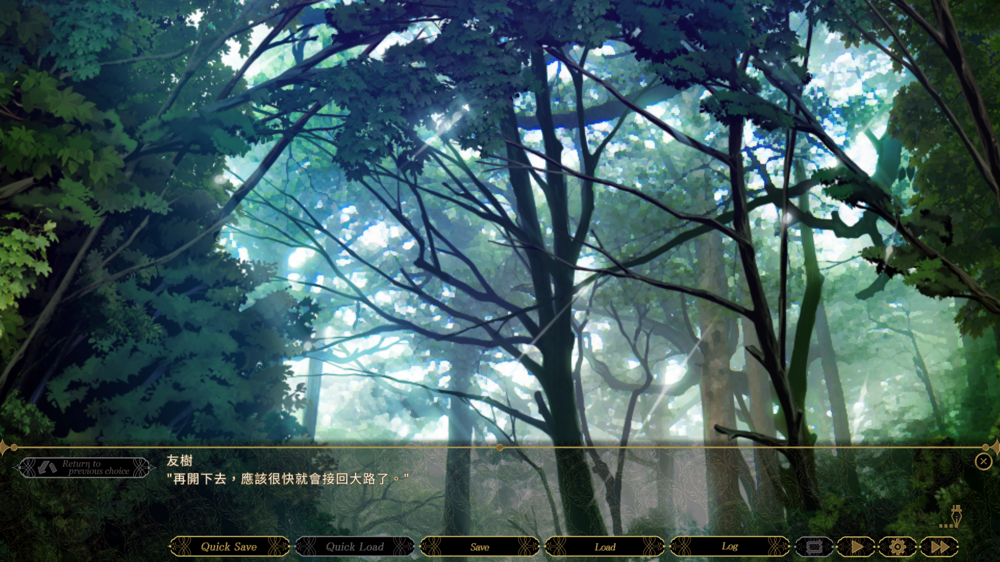

# 《SLEEPLESS Nocturne》非官方繁體中文化補丁

大家好，分享一下我製作的繁體中文補丁，翻譯主要利用GPT-5.6 Sol，最後用GPT-6 Astra覆核，但尚未逐句人工校對，如有明顯錯誤（如翻譯錯誤、翻譯遺失等...），歡迎在Steam討論串留言反饋

## ⭐補丁特點

- 全篇劇情對話、旁白及選項的繁體中文翻譯
- 使用 Noto Sans TC 字型，並放大對話與歷史紀錄的文字
- 重新調整中文換行，減少沿用英文斷行造成的不自然排版
- 選單、設定及圖片中的英文介面維持原樣

## ⚠️注意事項⚠️

> **下載和安裝代表同意以下注意事項內容**

- 安裝補丁後讀取以前的存檔很大機會有bug，如文字未正確顯示、場景錯誤等...
- 安裝補丁前，請另外備份原版存檔
- 安裝後建議從「Start」重新開始

## ▶️安裝步驟

1. 完全關閉遊戲
2. 在 Steam 收藏庫中，對遊戲按右鍵，選擇「管理」→「瀏覽本機檔案」
3. 備份遊戲資料夾內的 Rio1.arc、Fonts.arc、Script.arc
4. 將補丁中的同名檔案複製至遊戲資料夾，覆蓋原檔
5. 重新啟動遊戲

## ⬇️檔案下載

[按我一鍵下載](https://github.com/Johnson80331/SLEEPLES_Nocturne_Traditional_Chinese_Patch/raw/refs/heads/main/SLEEPLESS%20Nocturne%20%E7%B9%81%E9%AB%94%E4%B8%AD%E6%96%87%E8%A3%9C%E4%B8%81%201.0.0.zip)或手動下載[SLEEPLESS Nocturne 繁體中文補丁 1.0.0.zip](./SLEEPLESS%20Nocturne%20繁體中文補丁%201.0.0.zip)

## 🖼️截圖展示

按我展開

